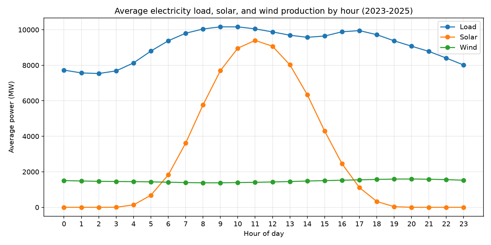
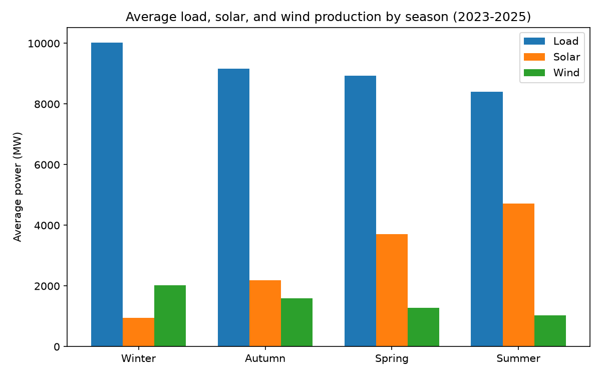
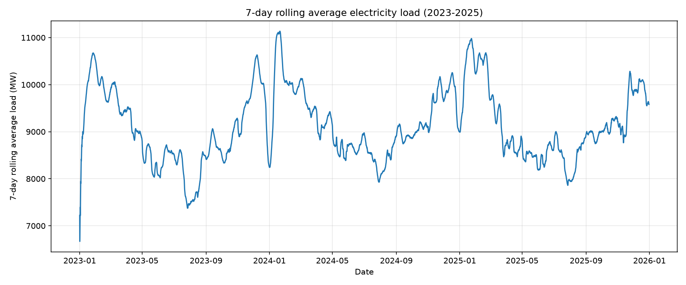

# Belgian Electricity Demand & Renewable Production Analysis

## Overview
This project analyzes how electricity demand (load) in Belgium relates to solar
and wind power production, using open data published by Elia, Belgium's
electricity transmission system operator. The goal is to understand daily and
seasonal patterns in demand and renewable supply, and how much of demand
renewables actually cover.

## Data
- Source: [Elia Open Data](https://opendata.elia.be)
- Datasets: total grid load, solar production (by region), wind production
  (by region, onshore/offshore)
- Time range used: January 2023 – December 2025 (the overlap across all three
  datasets)
- Resolution: 15-minute intervals

## Tools
- Python (pandas, matplotlib) for cleaning, merging, and visualization
- SQLite for storing and querying the merged dataset
- SQL: GROUP BY aggregation, CASE WHEN, window functions (rolling average)

## Key findings
- Demand follows a clear daily double-peak pattern, rising sharply in the
  morning and peaking around 8-11am, dipping slightly at midday, then rising
  again toward an early-evening peak around 5-6pm before declining overnight.
- Solar output peaks around midday, closely but not perfectly aligned with the
  morning demand peak, and drops to zero overnight, as expected.
- Winter has the highest average demand (10,027 MW) but the lowest solar
  output (953 MW) and the lowest renewable coverage of demand (29.6%).
  Summer shows the opposite pattern: the lowest average demand (8,397 MW),
  the highest solar output (4,723 MW), and renewables covering nearly two
  thirds of demand (64.8%).
- Renewable coverage of demand rises steadily from winter (29.6%) through
  autumn (40.0%) and spring (54.2%) to summer (64.8%) — driven mainly by
  solar, since wind output actually decreases across that same progression
  (2,025 → 1,593 → 1,280 → 1,034 MW).

## Charts

## How to run this project
1. Clone this repo
2. Create a virtual environment and install dependencies: